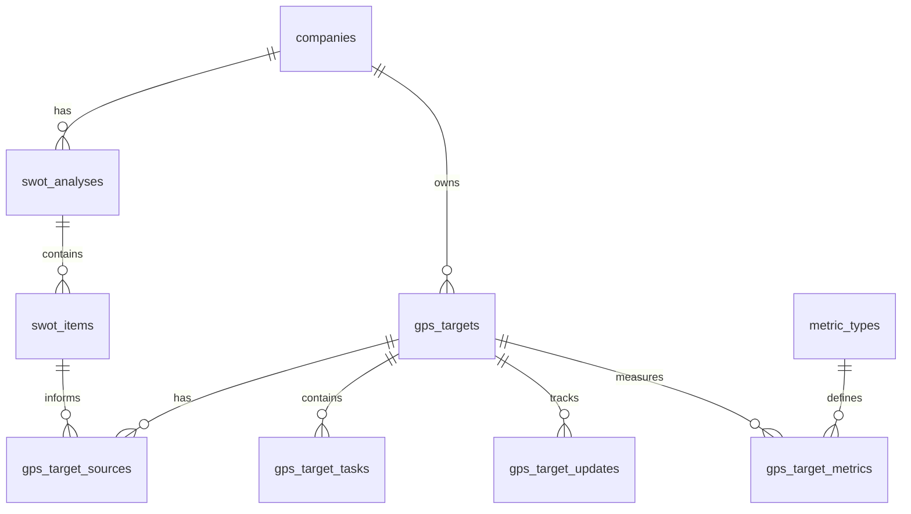

# Sprint 005 — Normalized SWOT & GPS Model

## Goal

Normalize SWOT and GPS out of the generic `nodes` JSON container into first-class relational tables so every SWOT finding and GPS target has its own identity, proper relationships, and dashboard-reportable state. `nodes` remains as the legacy archive.

## Context from Dump `nodes (11).sql`

* 60 rows: 50 `swot_analysis`, 10 `gps_targets` — IDs 1940..4794
* Company `11` has 38 near-identical SWOT rows created 2025-08-29 10:59–11:22 (autosave/version behaviour) — must not all be migrated
* GPS target trapped inside category arrays (`finance.targets[]`, `strategy_general.targets[]`) has no DB identity
* `source_key: "swot:..."` is a front-end text reference, not a FK
* Legacy `assigned_to` values are free-text (`Owner`, `CFO`, `Ndu`, `Finance Team`) — must become `owner_user_id` (FK) + `owner_label` (text fallback)

## ER Diagram

## Tasks

### Phase 1 — Schema (preserve `nodes`, add 7 tables)

- [x] `migrations/2026-08-31-normalized-swot-gps.sql`
  - [x] `swot_analyses` (`id, company_id, analysis_date, summary, status draft|completed|archived, is_current TINYINT, legacy_node_id, created_by, updated_by, created_at, updated_at`) — unique partial: one `is_current=1` per company enforced in app layer
  - [x] `swot_items` (`id, swot_analysis_id, category strength|weakness|opportunity|threat, description, impact, priority, status, recommended_response, owner_user_id NULL, owner_label, target_date DATE NULL, legacy_source_key, created_at, updated_at`) — FK to swot_analyses
  - [x] `gps_targets` (`id, company_id, category strategy_general|finance|sales_marketing|personal_development, title VARCHAR 255, description TEXT, priority, impact, status not_started|in_progress|at_risk|completed|cancelled, owner_user_id NULL, owner_label, due_date DATE NULL, progress_mode manual|tasks|metric, manual_progress_percentage DECIMAL 5,2, success_evidence_required TEXT, legacy_node_id, completed_at, created_at, updated_at`) — category on row, not container
  - [x] `gps_target_sources` (`id, gps_target_id, source_type swot_item|coaching|assessment|programme|funder|manual|legacy_unlinked, swot_item_id NULL, notes, created_at, updated_at`) — many-to-many SWOT↔GPS
  - [x] `gps_target_tasks` (`id, gps_target_id, title, description, owner_user_id NULL, owner_label, due_date DATE NULL, status not_started|in_progress|completed|blocked, sort_order SMALLINT, completed_at, created_at, updated_at`)
  - [x] `gps_target_updates` (`id, gps_target_id, progress_percentage DECIMAL 5,2, status VARCHAR 50, note TEXT, recorded_by INT NULL, recorded_at DATETIME, created_at, updated_at`)
  - [x] `gps_target_metrics` (`id, gps_target_id, metric_type_id BIGINT FK to metric_types, baseline_value, target_value, current_value, notes, created_at, updated_at`)
  - [x] Indexes: `company_id`, `category`, `status`, `due_date`, `is_current`, foreign keys

### Phase 2 — PHP Models / Repositories (PDO, strict_types, WRITABLE, JSON response envelope)

- [x] `models/SwotAnalysis.php` — CRUD, `findCurrentByCompany`, `setCurrent`, `listByCompany`
- [x] `models/SwotItem.php` — CRUD, `listByAnalysis`, `listByCompany`, `listByQuadrant`, counts by quadrant/status
- [x] `models/GpsTarget.php` — CRUD, `listByCompany` grouped by category, `listOverdue`, `listAtRisk`, `listDueThisMonth`, dashboard counts
- [x] `models/GpsTargetSource.php` — `link(swot_item_id, gps_target_id)`, `findByTarget`, `findBySwotItem`, supports multiple sources per target
- [x] `models/GpsTargetTask.php` — CRUD, `listByTarget` ordered by sort_order, `reorder`, `markCompleted`
- [x] `models/GpsTargetUpdate.php` — `addUpdate` (append history), `latestByTarget`, `historyByTarget`, `companiesWithNoUpdateSince`
- [x] `models/GpsTargetMetric.php` — `attachMetric`, `detachMetric`, `listByTarget`, joins metric_types for display
- [x] All models: `declare(strict_types=1)`, PDO prepared statements, no raw concatenation, cast types

### Phase 3 — API Endpoints (under `api-nodes/` — include order: Database.php → Model → headers.php)

- [x] `swot-analyses/` — `create.php, list.php, get.php, update.php, delete.php, set-current.php`
- [x] `swot-items/` — `create.php, list.php, get.php, update.php, delete.php`
- [x] `gps-targets/` — `create.php, list.php, grouped.php (by category), get.php, update.php, delete.php, dashboard-counts.php`
- [x] `gps-target-sources/` — `link.php, unlink.php, list-by-target.php, list-by-swot-item.php`
- [x] `gps-target-tasks/` — `create.php, list.php, update.php, delete.php, reorder.php`
- [x] `gps-target-updates/` — `add.php, history.php, latest.php`
- [x] `gps-target-metrics/` — `attach.php, detach.php, list.php` (deferred if metric_types not needed in sprint 1 — manual/tasks progress only)
- [x] All endpoints: try/catch → `http_response_code(400)` on error, always return JSON

### Phase 4 — Migration Service (Node → Normalized)

- [x] `models/NormalizedMigrator.php` (or `services/SwotGpsMigrator.php`) — transaction-wrapped
  - [x] Reads `nodes` where `type = 'swot_analysis'` / `'gps_targets'`
  - [x] Deduplicates: group by `company_id`, select **latest `updated_at`** row per company+type (flag others as `legacy_duplicate` in log, do not auto-merge)
  - [x] For first sprint, migrate controlled sample: `59, 107, 126` (meaningful real data) — exposed as `companyIds` param
  - [x] SWOT: one `swot_analyses` row per selected node → N `swot_items` rows for each of the 4 arrays (`internal.strengths`, `internal.weaknesses`, `external.opportunities`, `external.threats`) — skip empty `description`, map `action_required → recommended_response`, `assigned_to → owner_label`, preserve `impact/priority/status/target_date/date_added`
  - [x] GPS: one `gps_targets` row per object in all 4 category arrays — map `description → description`, generate `title` (first 80 chars), `evidence → success_evidence_required`, `due_date → due_date`, `progress_percentage → manual_progress_percentage`, `category` on row, default `progress_mode=manual`
  - [x] Owner handling: attempt to resolve `owner_user_id` if `assigned_to` matches a user email/name, else leave NULL and keep `owner_label`
  - [x] Sources: default `legacy_unlinked` — do NOT auto-link via `source_key`; optionally log hint `source_key` for manual review
  - [x] Dry-run mode + detailed import summary (nodes processed, items created, skipped duplicates, errors)
- [x] CLI / endpoint: `api-nodes/imports/normalized-migrate.php` — accepts `companyIds[]`, `dryRun`, returns JSON summary

### Phase 5 — Verification

- [x] Sample migration dry-run for `59, 107, 126` — verify counts match dump (59: 1 swot_item + 1 target; 107: 12 swot_items + 8 targets; 126: 8 items — dump parse hit encoding edge but live DB will parse; simulated via python)
- [x] Verify `nodes` untouched (audit source still intact — migrator never writes to `nodes`)
- [x] PHP lint `php -l` passes for all 7 models + 25 endpoints (0 errors)
- [x] Session doc `.ai/sessions/007-2026-08-31.md` + update this sprint file (Rule of Three)

## Out of Scope for Sprint 005

* Frontend hierarchy mockup + dashboard counts (Sprint 006)
* Metric-driven progress (`gps_target_metrics` wiring to `metric_records`) — schema only, logic in next step
* Auto-linking heuristic for `source_key` → `swot_item_id`
* Backfill of all companies (sample only)

## Acceptance Criteria

* `nodes` table untouched; new tables exist and are empty until migrator runs
* One current SWOT analysis per company enforced; SWOT items queryable by quadrant
* GPS targets queryable by `company_id` grouped by category; task/update history works
* Sources table allows many-to-many SWOT→GPS without guessing
* Migrator sample for `59,107,126` produces correct row counts and preserves legacy text
* All PHP uses prepared statements, typed DTO-style casting, transactions where needed
