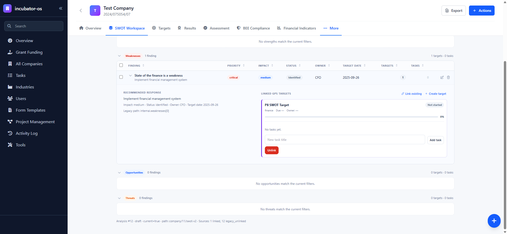
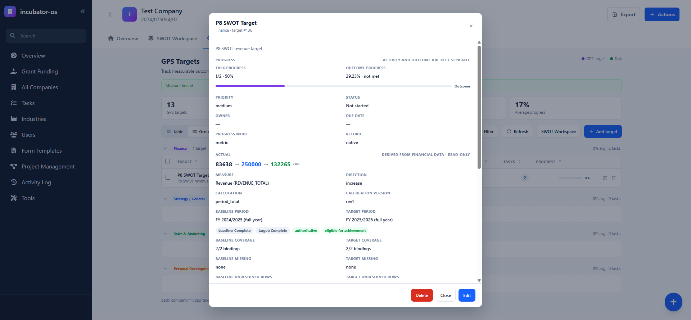
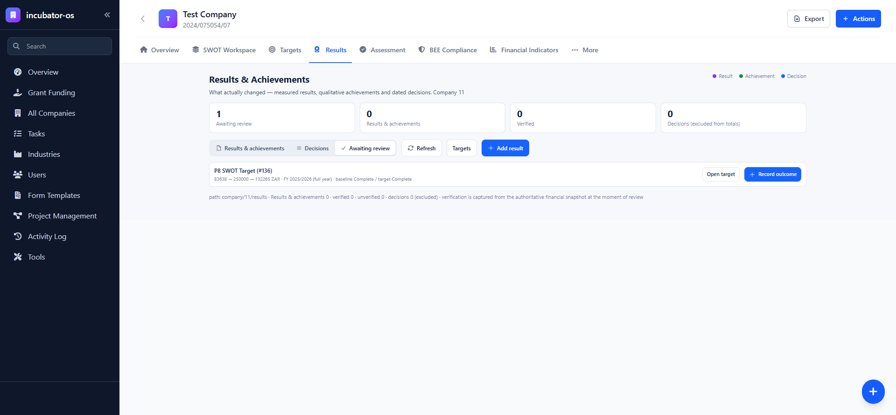
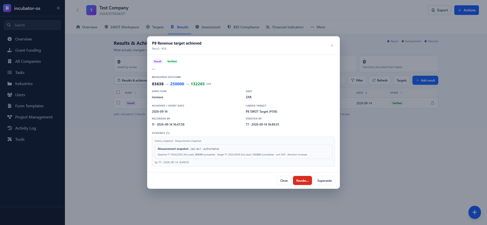
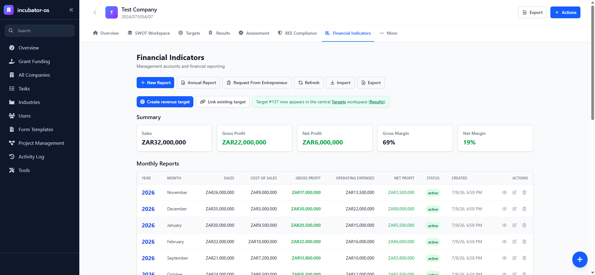
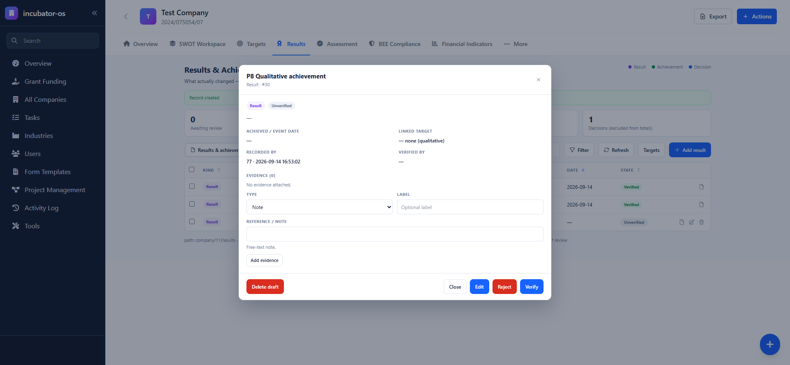
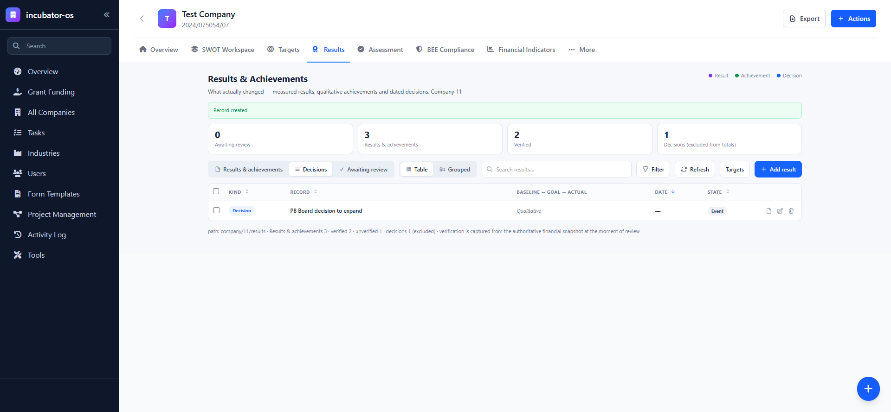

# Sprint 007 — Phase 8 Closure Proof, Reusable Pattern & Deployment Plan

**Date:** 2026-09-16
**Base:** `main` @ `1ca4895` (Phase 7 complete)
**Scope:** end-to-end verification of both entry points, lifecycle proof, technical sweep, reusable-pattern documentation, and a **plan-only** production deployment. **No production migration or deployment was performed.**

---

## 1. Screenshot index (durable review evidence)

All images are committed under [`docs/evidence/sprint-007/`](evidence/sprint-007/) so this proof remains reviewable after the authoring workspace is gone. The sidebar's personal user block (avatar + name) was redacted; the captures contain **no credentials, cookies, tokens or unrelated browser content**. Images are shown at their captured 1920×889 size.

> **Note on count.** Phase 8 captured eight frames, but `p8-progress-separate` and `p8-actual-authoritative` were byte-identical — the target popup's *Actual* panel renders the separated task/outcome progress and the authoritative actual together, so a single frame serves both scenarios. **Seven unique images** are committed below.

### 1.1 SWOT entry — linked measurable target

*Path A origin — a SWOT finding (#43) linked to a measurable target; provenance is preserved.*

### 1.2 Target popup — separated task/outcome progress and authoritative actual

*Task progress (`1/2 · 50%`) and outcome progress (`29.23% · not met`) are independent; the read-only **Actual** (`83,638 → 250,000 → 132,265 ZAR`) is derived from financial data with `baseline: Complete` / `target: Complete`, `authoritative` and `eligible for achievement` (2/2 bindings).*

### 1.3 Results — measured target awaiting review

*A measured target appears under **Awaiting review** before any achievement exists (`83638 → 250000 → 132265 ZAR · FY 2025/2026 · baseline Complete / target Complete`).*

### 1.4 Verified measurable achievement — single snapshot

*After verification the achievement is immutable, carries one `metric_snapshot · Measurement snapshot` (calc rev1, authoritative, baseline/target subtotals) and exposes only **Revoke…** / **Supersede**.*

### 1.5 Financial entry — created revenue target

*Path B origin — **Create revenue target** on `company/11/financial-indicators` produced **Target #137** and linked it to the central Targets/Results workspaces.*

### 1.6 Qualitative achievement (no target)

*A qualitative achievement with **no linked target** (`— none (qualitative)`), authored by a company user, editable while unverified.*

### 1.7 Decision excluded from counts

*A decision is labelled **Event**, has an achieved/event date and no Verify/Reject, and the footer counts it separately (`decisions 1 (excluded)`).*

---

## 2. End-to-end path A — SWOT entry

1. **Finding** — current SWOT analysis (company 11, analysis 12), weakness item #43.
2. **Create/link measurable target** — created **P8 SWOT Target** from the finding; provenance `gps_target_sources.source_type='swot_item'`, `swot_item_id=43` (verified in DB).
3. **Tasks** — added *P8 task one* and *P8 task two*; completed one.
4. **Decoupling proof** — before/after: `status = Not started` (unchanged), `manual = 0%` (unchanged), `task_progress = 1/2 · 50%`. Activity does not move outcome.
5. **Configure measurement** — bound `REVENUE_TOTAL`, direction `increase`, baseline `FY 2024/2025`, target `FY 2025/2026`, goal `250000`, method `period_total` (through the popup binding editor).
6. **Authoritative actual** — `83,638 → 250,000 → 132,265 ZAR`, both periods `complete`, `authoritative=true`, `eligible_for_achievement=true`.
7. **Awaiting Review** — the target appeared under Results → Awaiting Review with the trio + period and `baseline Complete / target Complete`.
8. **Create + verify achievement** — draft authored (as **Director**, `recorded_by=11`), then verified as **SA** (`verified_by=77`).
9. **Exactly one snapshot** — DB: `achievement_evidence` = 1 row, `source_type='metric_snapshot'`, `snapshot_json` ≈2.5 KB; `uq_evidence_metric_snapshot` prevents duplicates.
10. **Leaves Awaiting Review / appears correctly** — after verification the target is gone from Awaiting Review and the achievement shows in Results and in the target popup (with SWOT provenance).

## 3. End-to-end path B — Financial Indicators entry

1. **Create** — `company/11/financial-indicators` → **Create revenue target**.
2. **Prefill** — company `11`, measure `Revenue (REVENUE_TOTAL)`, baseline `FY 2024/2025`, target `FY 2025/2026` (selected in the dialog). *As of the release-readiness amendment (§9.1) the dialog derives these from the years' real periods rather than array position; at capture time the periods were chosen manually.*
3. **Open in Targets** — created **Target #137**, opened from Targets with the derived Actual (`83,638 → 300,000 → 132,265 ZAR`).
4. **Same path** — created a target-linked draft and verified it (1 snapshot).
5. **Provenance** — `gps_target_sources.source_type='manual'` with note *"Financial measure REVENUE_TOTAL · target period …"*. **No invented financial source type.**

---

## 4. Lifecycle & correctness proofs

| Proof | Result |
| --- | --- |
| Qualitative achievement without a target | Created (company 11, no `gps_target_id`), SA controls present. |
| Decision event-date presentation | Decision shows `Event · excluded from totals`, achieved/event date field, **no** Verify/Reject. |
| Decisions excluded from counts | Footer `Results & achievements 3 · decisions 1 (excluded)`; decision counted separately. |
| Draft evidence editable/deletable | `achievement-evidence/create.php` → added, `delete.php` → `success:true`. |
| **Verified evidence immutable** | After tightening: add/delete on a verified parent → **409** "Evidence on a verified record is immutable — revoke or supersede instead." |
| Rejection creates no snapshot | Rejected measurable draft → `verification_status=rejected`, `evidence=0`, `snapshots=0`. |
| Revocation preserves original + evidence | `revoke` → status `revoked`, `evidence=1`, `snapshots=1` retained. |
| Superseding creates a linked draft | `supersede` → new draft `supersedes_id=28`, status `unverified`; original #28 retained verified. |
| Repeated verification no duplicate | Second `verify` → **409** "Achievement is already verified."; snapshot count stays 1. |
| SA vs Director controls | Director: popup shows **Add** only (`recorded_by=11`); SA: Reject/Verify (unverified) and Revoke/Supersede (verified). |
| Company isolation | Director (company 11) → `actual.php?gps_target_id=49` (company 10) → **403** "you do not have access to this company". |
| Awaiting Review eligibility | Lists only `metric` targets with a binding, an eligible measurement and **no verified** non-decision achievement; the verified #136 left the list. |
| Global measure ≠ company-ready | `measures.php?company_id=10` → `REVENUE_EXPORT {account_count:0, usable:false}`; co11 → `usable:true`. The binding dropdown labels unavailable measures "— no company accounts (will read no_accounts)", and a bound-but-unresolvable measure renders **`no_accounts`**, never company-ready. |
| Completeness states | All render safely (proven in Phase 7): `complete`, `unknown`, `incomplete`, `partial_coverage`, `no_accounts`, `unconfigured`, `invalid_definition` (equal baseline/goal; zero-baseline percent). Partial/unknown subtotals are never presented as achieved. |
| UX | Backdrop click keeps dialogs open; header/footer fixed at 620px with only the body scrolling; grouped view persists across reload; 0 unexpected post-login console errors (only pre-auth 401s and intentional 409s). |

---

## 5. Technical verification

* **`php -l`** — full sweep of `api-incubator-os` (`find … | xargs php -l`): **no syntax errors**.
* **`ng build`** — **passes** (only pre-existing NG8107/i18n warnings).
* **Deleted-code references** — repository-wide search for `MetricRecord` / `enhanced-metrics`:
  * No executable consumer of the deleted `models/MetricRecord.php` or `api-nodes/enhanced-metrics.php`.
  * Remaining hits are unrelated: the TypeScript `IMetricRecord` interface (`src/models/metrics.model.ts`, consumed by `metrics.service.ts` and the metrics tabs — the `q1…q4` shape), `RatioCalculatorService::getMetricRecordsByYear` (a private method name over the live `metric_records` table), and documentation/session text.
* **Migrations** — both Sprint-007 migrations re-applied to the local schema: exit `0`, idempotent (`IF NOT EXISTS` / `information_schema` guards; the snapshot index reports "already exists").
* **Fixtures removed** — no `P8`/`P7` targets, achievements, accounts or stats remain.

### Final local database state

| Entity | Count |
| --- | --- |
| Companies | 136 |
| Company 11 accounts (active) | 2 (`Main Account`, `Secondary` restored) |
| Company 11 financial-year stats rows | 2 |
| Company 11 targets | 12 |
| Targets (all companies) | 18 |
| Achievements (all) | 1 (pre-existing company 10 record) |
| Achievement evidence (all) | 1 (pre-existing) |
| `gps_target_metrics` | 0 |

---

## 6. Reusable pattern

```
measure definition → company account resolution → period → calculation
        → completeness → actual → review → immutable achievement snapshot
```

1. **Measure definition** — `metric_types` (code/name/unit). A measure may also carry **global** bindings in `metric_type_accounts`; a global binding is a definition, **not** a company-readiness claim.
2. **Company account resolution** — `MetricTypeAccount::resolveAccounts($metricTypeId, $companyId)` resolves bindings against that company's `company_accounts` (`account_type` match or an `account_id` pin), deduplicating by account. No accounts → `no_accounts`.
3. **Period** — `financial_year` (`fy.id`), `quarter` (`<fy_id>:Qn`), or `custom` (single FY). Resolved to FY-relative month indices.
4. **Calculation** — implemented method `period_total` only. Values come from `company_financial_yearly_stats` (`m1…m12`); rows with `account_id IS NULL` are excluded and reported as `unresolved_rows`.
5. **Completeness** — most-conservative-first: `no_accounts → partial_coverage → incomplete → unknown → complete`. `authoritative` requires both periods `complete` **and** zero unresolved rows.
6. **Actual** — `TargetMeasurementService::calculateForTarget()` (read-only) returns baseline/target periods, subtotals, coverage, completeness, warnings, outcome progress and `eligible_for_achievement`. Never persisted.
7. **Review** — measurable targets appear under **Awaiting Review** when eligible and undecided.
8. **Immutable achievement snapshot** — `Achievement::verify()` computes the measurement **inside the verification transaction**, stores a `metric_snapshot` evidence row (unique per achievement) and the baseline/target/actual/unit/direction. Verified evidence is immutable; corrections use `revoke`/`supersede`.

### How this extends (not yet implemented)

* **Employment** — bind `EMP_*` measures to the employee-count data; same period/completeness/actual/review/snapshot flow.
* **Profitability** — bind `GROSS_PROFIT` / `OPERATING_PROFIT` / `NET_PROFIT_BEFORE_TAX` to revenue and expense account types.
* **Funding** — bind `FUNDS_*` to funding-received sources.
* **Ratios** — `RATIO_*` measures need a derived/`computed` calculation method (e.g. `ratio`), which requires a new `calculation_method` beyond `period_total`.
* **Qualitative milestones** — already supported end-to-end (achievements without a target; verification records no snapshot).

Each new adapter = a measure definition + its `metric_type_accounts` bindings (+ a calculation method where the value is derived). The popup, review queue, lifecycle and isolation rules are unchanged.

---

## 7. Production deployment plan (plan only — do not execute)

> **Hold point:** production migration and deployment require explicit authorization. Nothing below has been run against production.

### 7.1 Backup & preflight

1. Full DB backup (`rbttaces_api`) + confirm restorable; back up the current `api/` and Angular doc root.
2. Preflight queries on production:
   ```sql
   SELECT COUNT(*) FROM gps_target_metrics;                          -- expect: bindings only, no measurement rows required
   SELECT COUNT(*) FROM metric_type_accounts;                        -- expect the 5 seeded bindings
   SELECT COUNT(*) FROM company_financial_yearly_stats WHERE account_id IS NULL;  -- unresolved rows (reported, not repaired)
   SELECT COUNT(DISTINCT company_id) FROM company_accounts WHERE account_type='export_revenue' AND is_active=1;  -- export-account coverage (REVENUE_TOTAL completeness)
   SELECT code FROM metric_types WHERE id IN (1,2,12);
   SHOW INDEX FROM achievement_evidence WHERE Key_name='uq_evidence_metric_snapshot';
   ```
3. Confirm the target tables (`achievements`, `achievement_evidence`, `metric_type_accounts`) do not already exist.

### 7.2 Migration order

1. `api-incubator-os/migrations/2026-09-15-results-achievements.sql` (tables + additive `gps_target_metrics` columns + revenue bindings).
2. `api-incubator-os/migrations/2026-09-16-achievements-snapshot-guard.sql` (functional unique index `uq_evidence_metric_snapshot`).
3. Both are idempotent; re-running is safe.

### 7.3 API deployment order

1. Deploy the new/changed backend first (models, service, endpoints, helpers) — additive and read-safe with the old frontend.
2. Verify `php -l` and a smoke request per new endpoint.

### 7.4 Angular deployment order

1. Build (`npm run prod`) and deploy the Angular bundle after the API is live.
2. Confirm the SPA routes (`gps-targets-v2`, `results`, `financial-indicators`) and API base.

### 7.5 Permissions & roles

* No new role strings. Verification/rejection/revocation/supersede = **System Administrator** (`auth_is_system_administrator`); draft authoring = any company user (`auth_require_company_access`).
* Confirm production users' roles; confirm session cookie/domain settings in `headers.php` (prod values — do not overwrite blindly).

### 7.6 Post-deployment smoke tests

1. Create a measure binding and an actual for one company; confirm the derived actual and completeness.
2. Create a forward-dated target; confirm it is **not** awaiting review until eligible.
3. On a controlled eligible target: create + verify a measurable achievement; confirm **exactly one** `metric_snapshot`.
4. Confirm 409s: repeated verify; evidence add/delete on a verified record; ineligible verify.
5. Confirm a decision cannot be verified and is excluded from counts.
6. Confirm company isolation with a non-admin user.

### 7.7 Data-integrity queries (post-deploy)

```sql
-- at most one metric snapshot per achievement
SELECT achievement_id, COUNT(*) c FROM achievement_evidence
WHERE source_type='metric_snapshot' GROUP BY achievement_id HAVING c > 1;
-- evidence must belong to an achievement
SELECT COUNT(*) FROM achievement_evidence e LEFT JOIN achievements a ON a.id=e.achievement_id WHERE a.id IS NULL;
-- progress_mode=metric targets must have a binding
SELECT COUNT(*) FROM gps_targets g WHERE g.progress_mode='metric'
  AND NOT EXISTS (SELECT 1 FROM gps_target_metrics m WHERE m.gps_target_id=g.id);
-- unresolved rows remain reported, never silently summed
SELECT company_id, financial_year_id, COUNT(*) FROM company_financial_yearly_stats
WHERE account_id IS NULL GROUP BY company_id, financial_year_id;
```

### 7.8 Rollback boundaries

* **Reversible:** application code (old bundle/API), new tables (drop `achievement_evidence`, `achievements`, `metric_type_accounts`) and additive `gps_target_metrics` columns — provided no verified achievements exist.
* **Not reversible after verified achievements are created:** the stored `metric_snapshot` evidence and the baseline/target/actual recorded by verification are an **immutable audit record**. Downgrading the code does not delete them; rolling back the schema would destroy them. Treat verified snapshots as append-only history.

### 7.9 Authorization hold point

**Do not run 7.2–7.4 in production without explicit sign-off.** Production migration/deployment is out of scope for Sprint-007.

---

## 8. Material corrections & unresolved limitations

**Corrections made in Phase 8:**
1. **Verified evidence immutability (defect).** `AchievementEvidence::add()` allowed appending evidence to a *verified* record, contradicting the spec. Tightened: both `add()` and `delete()` now require an `unverified` parent (`409` otherwise); `verify()` still writes its snapshot before the status flip, so it is unaffected. Re-tested.
2. **Stale evidence count (defect).** `ResultsPage.refreshRecord()` did not reload the open popup's evidence list after lifecycle actions, so a verified record showed `EVIDENCE (0)`. Now reloads evidence when the popup record matches.
3. **`measures.php` company-usability.** Added optional `?company_id=` → `usable`/`account_count`, and the binding dropdown now labels measures with no company accounts, so a global binding is not presented as company-ready.

**Release-readiness amendment (2026-09-16) — see §9:**
4. **Financial-year prefill (defect).** The target-entry dialog selected the *first two* financial years by array position (`years[0]`/`years[1]`), which could silently produce the wrong baseline/target periods (the API returns `ORDER BY id`, arbitrary relative to dates). Replaced with date-ordered selection: **target = current/open/latest applicable year, baseline = its immediate predecessor**, explicit empty selection when fewer than two valid years exist, and deliberate user selections preserved. Details and cases in §9.1.
5. **Evidence durability (review gap).** The eight Phase 8 screenshots were gitignored; redacted copies are now committed under `docs/evidence/sprint-007/` and linked from §1.

**Unresolved limitations:**
* Only `period_total` is implemented; ratios/derived measures need new calculation methods.
* Combined revenue (`REVENUE_TOTAL`) is `partial_coverage` wherever a company lacks `export_revenue` accounts (reported, not repaired); no data was backfilled. Quantified in §9.2.
* `useMocks`-style demo data and 105 unresolved financial rows remain as-is.

---

## 9. Release-readiness note — remaining data limitations

> **No repair or backfill was performed.** The figures below quantify the *local reference dataset* (`incubator_os`); the production equivalent must be measured with the preflight queries in §7.1 before any deployment. Affected measurements remain **non-authoritative and cannot be verified** — the UI reports `partial_coverage` / `no_accounts` / `unresolved_rows`, it never fabricates a value.

### 9.1 Financial-year period selection (amendment)

`FinancialTargetEntryComponent` now orders `financialYears` by their real period (start month/year, then end) instead of array position and derives defaults as follows:

| Case (verified in-browser) | Result |
| --- | --- |
| Current year present (`is_active` or period contains today) | Target = current/latest applicable year, Baseline = immediate predecessor (FY 2025/2026 → FY 2026/2027). |
| API returns years **unsorted** (reversed; current year moved off index 0) | Same selection — position-independent; dropdown options re-sorted chronologically. |
| Current year absent, active year present | Target = active year, Baseline = its predecessor (FY 2023/2024 → FY 2024/2025). |
| Current and active absent | Target = latest year, Baseline = its predecessor (FY 2028/2029 → FY 2029/2030). |
| Exactly one valid year | Target = that year; **Baseline left empty** with an inline prompt; save blocked ("Select a baseline financial year…"). |
| No valid years | Both selections empty; both inline prompts shown. |
| Deliberate selection, then Cancel → reopen | Retained (e.g. FY 2023/2024 → FY 2024/2025). |

A year is "valid" only when its period can be determined; years without a start date are never auto-selected. QA was performed through request interception (Playwright route) to inject unsorted/limited responses; `ng build` passes.

### 9.2 Affected data (local reference dataset)

| Metric | Count |
| --- | --- |
| Companies with financial accounts | 81 |
| … holding an **`export_revenue`** account (active) | **0** |
| … holding only `domestic_revenue` | 81 |
| Companies with `company_financial_yearly_stats` rows | 96 |
| `company_financial_yearly_stats` rows (total) | 179 |
| … with **`account_id IS NULL`** | **105** |
| Companies owning those unresolved rows | 65 |
| Companies with statistics **and** an export account | 0 |

**Revenue measures affected:**

* **`REVENUE_TOTAL`** (id 1, combined domestic + export) — for **every** company with financial data (96) the export half does not resolve, so periods report **`partial_coverage`**; the subtotal is domestic-only revenue and is **not** eligible for achievement.
* **`REVENUE_ANNUAL`** (id 12, same two bindings) — same effect wherever it is used as a measure.
* **`REVENUE_EXPORT`** (id 2) — **`no_accounts`** for **every** company (0 export accounts), so it can be bound but never yields an actual.
* **Any period touching a row with `account_id IS NULL`** (105 rows across 65 companies) — excluded and reported as `unresolved_rows`; completeness can never reach `complete`, so such periods are non-authoritative and ineligible for achievement.

**Distinction:** these measures remain fully **usable as definitions** (global bindings exist in `metric_type_accounts`); they are simply **not company-authoritative** until the company holds matching accounts and its rows are resolved — a deliberate report-don't-repair stance. The production preflight (`SELECT COUNT(*) … WHERE account_id IS NULL` and the export-account count) will quantify the live dataset at the authorization gate.
